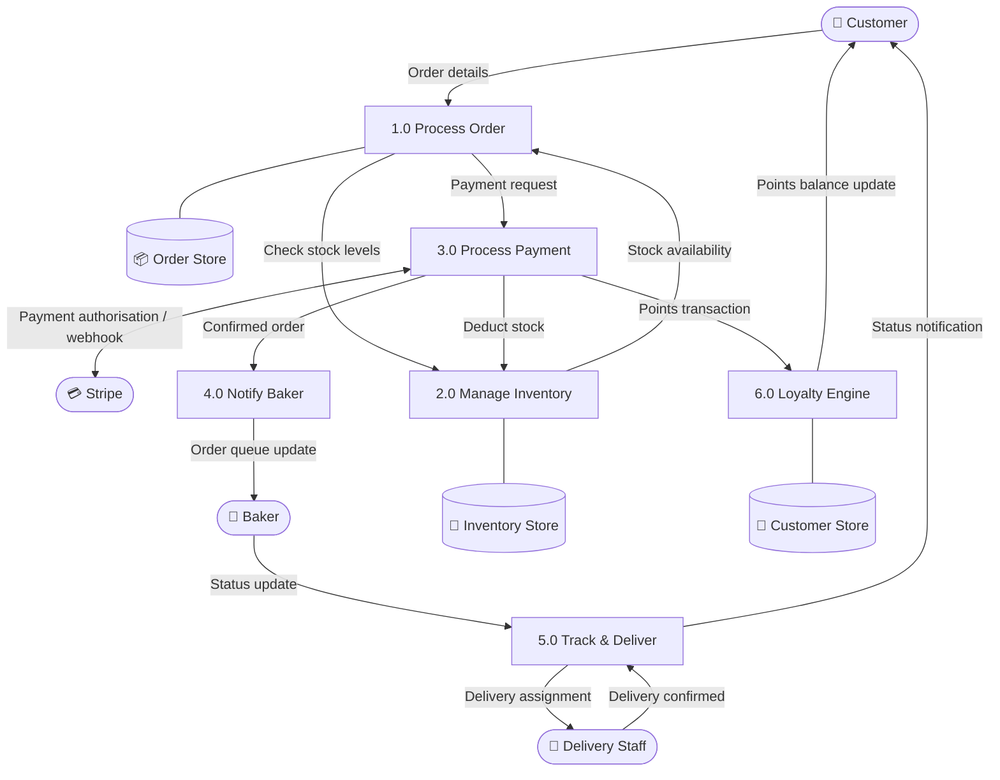
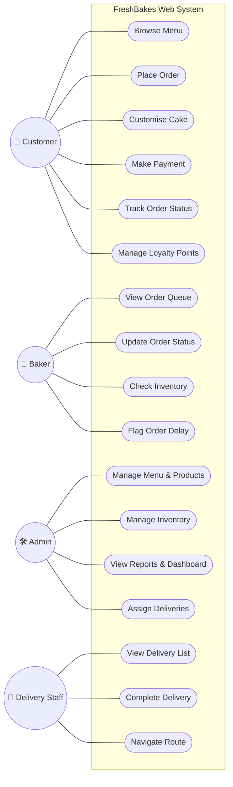
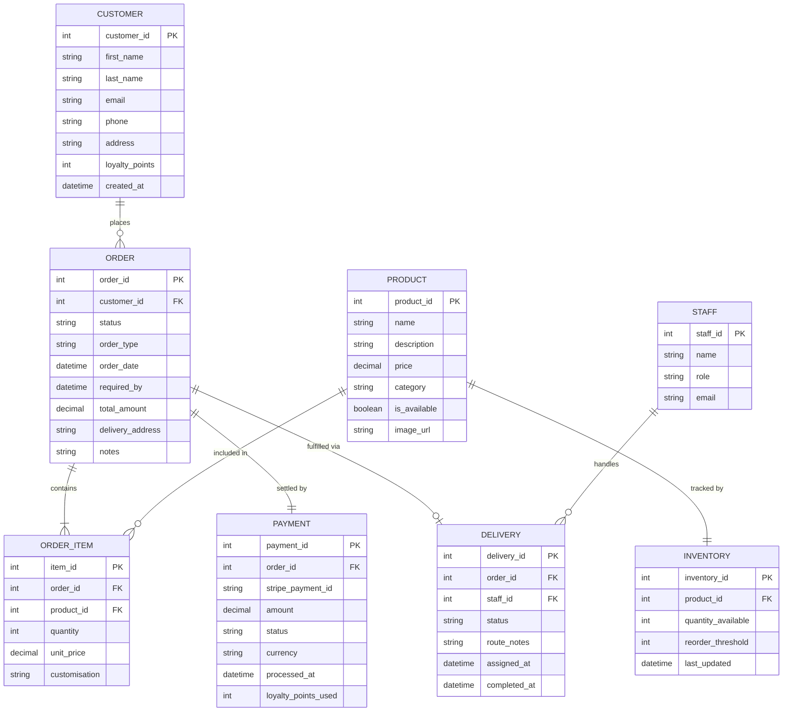
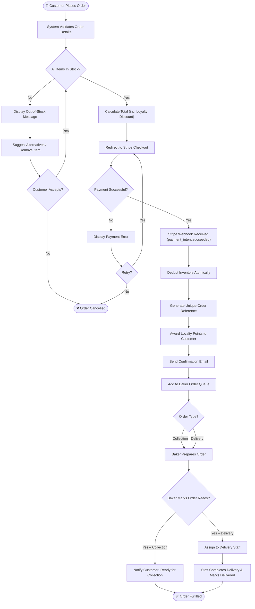

# **FreshBakes Bakery — System Design Specification**

### **IS501 Project Report | Nicosia, Cyprus**

---

**Case Study:** FreshBakes Bakery is a family-owned shop in Nicosia, Cyprus, specialising in fresh pastries, cakes, and custom orders. The owner seeks a web-based system to manage customer orders, inventory, payments, and delivery scheduling in response to growing online demand and the post-2025 tourism boom.

---

## **Table of Contents**

1. [Phase 1 — Methodology Evaluation](#phase-1)  
2. [Phase 2 — Feasibility Study](#phase-2)  
3. [Phase 3 — Requirements Engineering](#phase-3)  
4. [Phase 4 — System Design Specification](#phase-4)

---

---

## **Phase 1: Methodology Evaluation**

### **1.1 Overview**

Two dominant systems analysis methodologies are evaluated for FreshBakes Bakery's web-based ordering platform: the **traditional Waterfall model** and the **Agile (Scrum) framework**. Each carries distinct strengths shaped by their core philosophy, Waterfall enforces sequential discipline; Agile embraces adaptive iteration.

Given that FreshBakes operates a mix of fixed, rule-bound processes (inventory deduction, permanent handling) alongside highly fluid, customer-shaped features (custom cake design, delivery scheduling, loyalty tracking), neither methodology is optimal in isolation. This evaluation identifies where each approach adds value, where it fails short in the Freshbakes context, and justifies a hybrid recommendation.

### **1.2 Structured Comparison** 

The table below compares both methodologies across ten criteria. Note that weaknesses are surfaces for both approaches. Agile is not without risk in the FreshBakes context, particularly given the owner’s limited availability and the team’s small size.

| Criterion | Waterfall | Agile (Scrum) |
| :---- | :---- | :---- |
| Philosophy | Linear, sequential phases; each phase completed before the next begins | Iterative sprints (2–4 weeks); continuous delivery and real-user feedback |
| Requirements | Fully defined upfront; changes are costly and actively discouraged | Requirements evolve across sprints; change is welcomed as a competitive advantage |
| Change Management | Formal change-control process; late changes are expensive and disruptive | Lightweight; changes incorporated into the next sprint backlog with minimal overhead |
| Customer Involvement | Heavy at start (requirements) and end (acceptance); minimal during development | Continuous, Product Owner reviews and redirects at every sprint demo |
| Testing | Deferred to a dedicated Testing phase near project end; bugs discovered late | Embedded in every sprint; issues caught early and resolved before they compound |
| Documentation | Comprehensive and mandatory at every phase gate; creates an audit trail | Lightweight, just enough to support the sprint; can create gaps for future maintenance |
| Team Structure | Role-siloed (Analysts → Designers → Developers → Testers); handoffs create delays | Cross-functional squads; shared ownership, but requires skilled, self-organising members |
| Risk Profile | High: failures discovered late; rework is expensiveWeakness: risk is hidden until testing phase | Lower per-sprint,  risks surfaced incrementallyWeakness: incomplete documentation and dependency on an active Product Owner introduce their own risks |
| Delivery | Single release at project end; no working software until completion | Incremental working software after each sprint; stakeholders see value early |
| Predictability | High timeline/cost predictability if scope is stable | Variable scope; predictable velocity per sprint,  but overall timeline can drift without discipline |
| Best Suited For | Regulatory systems, embedded systems, fixed-scope projects with stable requirements | Customer-facing apps, evolving UX, start-ups, R\&D, and projects with an engaged stakeholder |

### **1.3 Specific Constraint Analysis**

#### **How Waterfall for fixed "Inventory Rules"**

FreshBakes' inventory logic is rule-bound and deterministic: a confirmed Stripe payment triggers an immediate stock deduction; reorder alerts fire at predefined thresholds; daily stock counts follow a fixed cycle. These are stable, well-understood business rules that can be fully specified upfront in a requirements document.

**Waterfall is appropriate here because:**

* The business logic does not evolve, "deduct 2 croissants per order" is not subject to customer feedback.  
* A complete data model (SKU, quantity, threshold) can be designed once and built without iteration.  
* Rigorous documentation of inventory rules supports future audits and staff training.  
* Any deviation during development is caught in a formal testing phase against pre-written acceptance criteria.

**Weakness:** If a new inventory category (e.g., seasonal ingredient tracking) is introduced post-design, Waterfall forces a costly change-request cycle that can delay the wider project.

**Agile (Scrum) for Custom Cake Design Iterations**

Custom cake orders are the antithesis of fixed requirements, a customer may not know they want a fondant tier until they see a mockup; the baker may suggest a flavour substitute mid-design, holiday themes change weekly. Requirements here are inherently emergent.

**Agile (Scrum) is superior here because:**

* Sprint 1 delivers a basic order form (flavour, size, message); custom feedback refines Sprint 2 into a visual design picker.  
* The Product Owner (baker owner) demos each sprint and redirects based on real customer reactions.  
* A/B testing of UI layouts for the cake configurator sits naturally within a sprint cycle.  
* Features like image upload or decorator collaboration can be added to a future sprint backlog without disrupting current work.

**Weaknesses:** Without discipline, scope creep risks delaying the core ordering system. More critically for FreshBakes, the bakery owner doubles as Product Owner while managing daily operations, consistent availability for sprint demos cannot be guaranteed. If the Product Owner is absent or disengaged, the feedback loop that Agile depends on breaks down. A well-maintained backlog, sprint velocity tracking, and agreed demo slots mitigate this risk.

**Agile’s broader Weaknesses in the FreshBakes Context.**

Beyond scope creep, Agile carries two additional risks specific to this project:

* **Documentation Gaps:** Agile's “just enough documentation” principle can leave future staff or maintainers without sufficient reference material. For a family business likely to onboard new staff over time, this is a real operations risk.  
* **Team Size Constraints:** Scrum assumes self-organising cross-functional team. The assumed two-person freelance development team is lean for a full Scrum implementation like daily stand-ups and retrospectives may be abbreviated, reducing some of the framework’s protective mechanisms.

### **1.4 Comparative Illustration \- FreshBakes Context**

The table below illustrates how the two methodologies play out in practice across two contrasting FreshBakes modules. The deterministic inventory backed and the iterative custom cake configurator.

| WATERFALL \-  Inventory Module | AGILE (Scrum) \- Custom Cake Module |
| :---: | :---: |
| Requirements locked — Week 1 **↓** | Sprint 1: Basic order form\[Demo → Feedback\] **↓** |
| System Design (ERD, DFDs) **↓** | Sprint 2: Flavour / size picker\[Demo → Feedback\] **↓** |
| Build inventory deduction logic **↓** | Sprint 3: Image upload \+ preview\[Demo → Feedback\] **↓** |
| Integration test (Stripe hook) **↓** | Sprint 4: Baker approval workflow\[Demo → Feedback\] **↓** |
| Deploy \- no mid-build surprises | Release \- shaped by real users |

 

### **1.5 Justified Recommendation: Hybrid Agile-First Approach**

**Recommended Methodology: Agile (Scrum) with Waterfall-style governance for the Inventory & Payment modules.**

**Rationale:**

FreshBakes is a small business undergoing digital transformation in a dynamic market (post-2025 tourism surge, evolving customer expectations). The majority of the system ordering UX, custom cake configurator, delivery scheduling, loyalty tracking benefits significantly from iterative refinement with real user input. These modules are driven by customer behaviour that cannot be fully anticipated at the outset.

However, the inventory and payment subsystems have fixed, auditable rules tied to legal and financial compliance.  These  justify upfront specifications and are best treated as a Waterfall "mini-project" within Sprint 0\. To be precise: Sprint 0 remains an Agile ceremony for environment setup and backlog grooming, but the design approach for these two modules within that sprint is specification first. Requirements are locked before build begins, and the output is a stable backend API that the subsequent Agile sprints consume.

This hybrid model is well-supported in the literature (Boehm & Turner, 2003; Larman & Basil, 2003\) and is pragmatic for a small team operating under budget and timeline constraints. 

One risk with acknowledging: hybrid approach can create integration friction when a specification-locked backend API needs to accommodate change driven by the Agile front-end sprints. This is mitigated by designing the inventory and payment APIs with clear, versioned contracts from the outset.

| Module | Recommended Approach | Justification |
| :---- | :---- | :---- |
| **Inventory management** | **Waterfall (Sprint 0\)** | Fixed, auditable rules; no UX iteration needed |
| **Stripe payment integration** | **Waterfall (Sprint 0\)** | Regulatory and deterministic; tested against a written spec |
| **Online ordering / UX** | **Agile Scrum** | Customer-driven and evolving; needs real feedback each sprint |
| **Custom cake configurator** | **Agile Scrum** | Inherently iterative; high UX complexity with emergent requirements |
| **Delivery route scheduling** | **Agile Scrum** | Optimisation logic improves progressively with real usage data |
| **Loyalty programme** | **Agile Scrum** | Business rules will evolve with promotion cycles and customer behaviour |
| **Admin dashboard** | **Agile Scrum** | Baker and admin needs best discovered through hands-on use |

**Overall Assessment**

Neither Waterfall nor Agile alone is the right answer for FreshBakes. Waterfall provides the discipline and the auditability the payment and inventory modules require; Agile on the other hand gives the ordering UX, cake configurator, and loyalty programme the iterative refinement they need to match real customer behaviour. 

The hybrid approach is not a compromise, it is a deliberate context-aware allocation of methodology. Managed with versioned API contracts and disciplined sprint ceremonies, it’s the most appropriate framework for a small budget-conscious business entering digital transformation in a competitive, tourist-driven market.

## **Phase 2: Feasibility Study**

**2.0** **Feasibility Study (TELOS Framework)**

This feasibility study evaluates the proposed web-based ordering system across five dimensions using the TELOS framework (Technical, Economic, Legal, Operational, Schedule). The standard four-dimension model has been extended to include Legal feasibility, given that FreshBakes operates under EU/Cyprus regulatory obligations covering customer data and online payment weighted importance evaluation is provided in the summary.

### **2.1 Technical Feasibility**

FreshBakes requires a standard web stack; no exotic infrastructure. Cloud providers (AWS, GCP, or DigitalOcean) offer Cypriot-region hosting with \~99.9% SLA uptime, capable of handling 100+ daily orders without strain. Stripe's payment API is mature, well-documented, and already widely used in Cyprus e-commerce. A React/Next.js frontend \+ Node.js backend is a proven combination for SME food-ordering platforms of this scale. 

The delivery mobile interface can be delivered as a Progressive Web App (PWA), eliminating app store overhead while running on any smartphone or tablet, the only hardware requirement for bakers and delivery staff. Development is assumed to be outsourced to a two-person freelance team, a realistic and cost-effective arrangement for a project of this scope. 

However, one technical dependency worth noting is reliable broadband at the bakery itself; the owner should confirm stable internet access as a pre-project prerequisite, since the entire system depends on it.

**Verdict:** Technically feasible with low complexity and low infrastructure risk

### **2.2 Economic Feasibility**

Economic feasibility carries the greatest weight for FreshBakes. As a family-owned business with limited capital, the investment must be justified quickly and clearly. The figures below are conservative projections based on typical SME food ordering system benchmark and the bakery’s stated operational pain points.

**Setup Cost Breakdown**

| Item | Cost |
| :---- | :---- |
| Development (web \+ mobile PWA) | €3,500 |
| Cloud hosting setup \+ domain | €300 |
| Stripe integration & testing | €200 |
| Staff training & documentation | €600 |
| Contingency (10%) | €400 |
| **Total Setup Cost** | **€5,000** |

**Projected Annual Savings**

Each savings line is grounded in the bakery’s documented pain points. Reduced stockout losses (€4,500) are estimated from the cost of emergency restocking and lost sales during peak periods, a known issue for the bakery. The tourism traffic uplift (€7,000) reflects the post-2025 Nicosia visitor volume increase, where digital-native tourists generate higher average order values than walk-in locals. 

Also, Staff time savings (€3,500) account for roughly 2 hours per day currently spent on manual record-keeping across bakers and admin. These are conservative estimates, actual returns may be higher once the loyalty programme is fully embedded.

| Savings Source | Estimated Annual Value |
| :---- | :---- |
| Eliminated order mix-ups & reprints | €3,000 |
| Reduced stockouts (better inventory) | €4,500 |
| Online orders from tourism traffic | €7,000 |
| Staff time savings (manual records) | €3,500 |
| Loyalty programme repeat business | €2,000 |
| **Total Projected Annual Savings** | **€20,000** |

**3-Year Cost-Benefit Projection**

| Year | Revenue/Savings | Operating Costs (hosting \+ maintenance \~€1,200/yr) | Net Benefit | Cumulative |
| :---- | :---- | :---- | :---- | :---- |
| Year 0 | — | €5,000 setup | \-€5,000 | \-€5,000 |
| Year 1 | €20,000 | €1,200 | €18,800 | **\+€13,800** |
| Year 2 | €20,000 | €1,200 | €18,800 | \+€32,600 |
| Year 3 | €20,000 | €1,200 | €18,800 | \+€51,400 |

Operating cost of €1,200/year covers cloud hosting and routine maintenance. Payback period approximately 3 months. 3-year ROI: \~928%, based on cumulative net benefit of €51,400 against a €5,000 initial investment. This ROI figure assumes savings projections hold; actual performance should be reviewed at the 6-months and 12-month marks.

**Verdict: Highly economically feasible. The strongest argument for proceeding.**

### **2.3 Legal Feasibility**

| Regulation  | Requirement  | How the System Addresses It |
| :---- | :---- | :---- |
| GDPR (EU 2016/679)  | Customer data collected with consent; stored securely; deletable on request | Cookie consent banner, privacy policy page, and data deletion workflow in admin panel |
| PCI DSS  | Secure handling of card payment data | Stripe handles all card data server-side; FreshBakes never stores card details, placing it outside PCI DSS scope |
| Cyprus Consumer Protection Law (L.81(I)/2013) | Order confirmations, refund policy, transparent pricing for online sales | Automated order confirmation emails; refund/returns policy displayed at checkout |
| eIDAS (EU Electronic Signatures) | Electronic records must be legally valid | Order confirmation emails constitute valid electronic records under EU law |
| Food Business Registration | Existing compliance assumed; digital system adds no new regulatory category | No additional licensing required |

Operating in Cyprus as an EU member state, FreshBakes is subject to several regulations that a web system must be designed to comply with from the day one, not as an afterthought.

**Verdict:** Legally feasible with standard EU compliance measures built into the system design.

### **2.4 Operational Feasibility** 

The primary operational risk is **staff adoption**. FreshBakes currently operates on notebooks and spreadsheets, so moving to a digital dashboard represents a meaningful cultural shift for a small team, which must be handled carefully. That said, the system must be designed around familiar interfaces rather than complex software, which significantly lowers the adoption barrier.

The most critical adoption factor in any family business is the owner. If the owner is not confident using the admin dashboard, the system risks being bypassed in favour of old habits. This is addressed through a dedicated onboarding session before go-live, a unified UI with minimal navigation depth, and a written quick reference guide kept at the counter. The onboarding plan is not an option; it is a go-live condition.

| Stakeholder  | Challenge  | Mitigation |
| :---- | :---- | :---- |
| Owner / Admin  | Learning and trusting the admin dashboard; risk of reverting to manual records | Dedicated pre-launch onboarding; simple UI; quick-reference guide. Onboarding sign-off required before go-live |
| Bakers  | Viewing order queue digitally instead of paper tickets | Large-font Baker Dashboard, tablet-optimised; hands-on training in Sprint 4 |
| Delivery Staff  | Using mobile delivery app for route and order management | PWA on personal phones; GPS interface mirrors familiar tools like Google Maps |
| Customers  | Adopting online ordering over phone calls | Intuitive UX designed for first-time users; tourism visitors already expect and prefer digital ordering |

The 2025 Cyprus tourism boom is a positive operational factor. Tourist customers actively prefer digital ordering over phone calls and have higher average order values. The system directly addresses FreshBakes' three stated pain points: stockouts, order mix-ups, and missing loyalty tracking.

**Verdict:** Operationally feasible with medium confidence. Staff adoption is manageable but requires a structured onboarding and change-management plan as a non-negotiable pre-launch step.

### **2.5 Schedule Feasibility**

Development follows an Agile (Scrum) approach using 2-week sprints,delivered by an assumed two-person freelance development team. This team size and methodology is a stated assumption; the schedule should be re-validated if the team composition changes. Sprint 0 covers environment setup, tooling configuration, and backlog grooming, not deliverable features which is the correct Agile convention. 

| Phase  | Duration  | Key Deliverables |
| :---- | :---- | :---- |
| Sprint 0: Foundation  | Weeks 1–2  | Dev environment, tooling setup, backlog grooming, architecture sign-off |
| Sprints 1–2: MVP Ordering  | Weeks 3–6  | Online order form, baker dashboard, automated email confirmations |
| Sprints 3–4: Payments & Inventory | Weeks 7–10  | Stripe checkout, live stock deduction, admin dashboard |
| Sprints 5–6: Delivery & Loyalty  | Weeks 11–14  | Delivery PWA, route assignments, loyalty points module |
| UAT & Soft Launch  | Weeks 15–16  | Real-order testing, bug fixes, staff training sessions |
| Full Go-Live  | Week 16  | System live — all features operational |

A 16-week (4-month) timeline is realistic for a two-person team working on a project of this scope. Critically, this schedule positions FreshBakes to go live before the peak summer tourism season, which is the primary revenue opportunity the system is designed to capture. Missing that window would significantly reduce first-year savings projections and delay the payback period.

**Verdict:** Schedule feasible. Go-live achievable within one business quarter, contingent on team availability and timely stakeholder feedback during sprints.

### **2.6 TELOS Summary & Importance Evaluation**

Not all feasibility dimensions carry equal weight for FreshBakes. The table below summaries each dimension and reflects its relative importance in the context of a small, capital-constrained family business operating in a seasonal tourism market.

| Dimension  | Status  | Confidence  | Importance to FreshBakes |
| :---- | :---- | :---- | :---- |
| Technical  | Feasible  | High  | Moderate/high, standard stack reduces risk; internet reliability is the only real dependency |
| Economic  | Feasible  | High  | Critical, limited capital means ROI must be clear and fast; 3-month payback de-risks the investment |
| Legal  | Feasible  | High  | High, EU/Cyprus compliance is non-negotiable; GDPR and PCI DSS exposure must be resolved by design |
| Operational  | Feasible  | Medium  | High, owner adoption is the single biggest success factor; onboarding plan is a go-live condition |
| Schedule  | Feasible  | High  | High,  missing the summer tourism window directly reduces Year 1 savings and delays payback |

**Overall Verdict:** The FreshBakes web system is feasible across all five TELOS dimensions and is recommended for initiation. Economic and schedule feasibility are the most critical factors for a business of this size and seasonality. The one conditional requirement before go-live is a confirmed staff onboarding plan, particularly for the owner, to ensure the system is adopted rather than bypassed. Subject to that condition, the project presents a compelling, low-risk investment with a measurable return within the first quarter of operation.

## **Phase 3 — Requirements Engineering**

### **3.1 User Requirements**

User Requirement specify what each actor can do in the system

#### **Customer**

| ID | User Requirement |
| :---- | :---- |
| UR-C01 | I want to browse full menu with photos and current prices |
| UR-C02 | I want to be able to choose between pickup or door delivery |
| UR-C03 | I want to customize and personalize cake orders by picking size, flavor, decorations and specifying special requests in a person message space |
| UR-C04 | I want to pay securely online with my card via Stripe |
| UR-C05 | I expect immediate feedback when the order payment goes through  |
| UR-C06 | I want to see my order status in real-time  |
| UR-C07 | I want to earn loyalty points and easily see available balance |
| UR-C08 | I want to use loyalty points to get discounts  |
| UR-C09 | I want to create, manage and update my personal profile |
| UR-C10 | I want to be able to see my previous orders |

#### **Baker**

| ID | User Requirement |
| :---- | :---- |
| UR-B01 | I need to see a prioritized queue of all incoming orders so I know what to bake first |
| UR-B02 | I want to quickly update an order's status as I work (e.g., moving it from "Preparing" to "Ready"). |
| UR-B03 | I need to see all the specific, custom details for special cake orders at a glance. |
| UR-B04 | If something goes wrong, I need a way to flag an order as delayed and leave a note explaining why. |
| UR-B05 | I want to be able to check exactly how much of any ingredient we have left in stock |

#### **Admin (Owner)**

| ID | User Requirement |
| :---- | :---- |
| UR-A01 | I need to easily add new cakes, update prices, or remove items from the menu. |
| UR-A02 | I want to manage our inventory and set automatic alerts so we know when to reorder supplies |
| UR-A03 | I need a daily dashboard showing me orders, revenue, and any urgent stock warnings |
| UR-A04 | I need the ability to manage customer accounts, including adjusting their loyalty points if there's an issue |
| UR-A05 | I want to assign specific delivery orders to my drivers for the day. |
| UR-A06 | I need the system to generate clear reports on our sales and inventory. |

#### **Delivery Staff**

| ID | User Requirement |
| :---- | :---- |
| UR-D01 | I just want to open the app and see my specific delivery route for the day. |
| UR-D02 | I need quick access to the customer’s address and phone number for every stop. |
| UR-D03 | I need a simple button to mark a delivery as completed once I hand off the cake. |
| UR-D04 | I want the app to suggest the best driving route based on the traffic and order delivery locations |

---

### **3.2 Stakeholder Analysis**

Before defining detailed system requirements, it is essential to identify all stakeholders and their concerns. A stakeholder is any individual, group, or system that has an interest in or influence over the system under development. The FreshBakes system involves both human actors and external technical services, each with distinct roles and expectations.

| Stakeholder | Role in the System | Key Needs / Concerns |
| :---- | :---- | :---- |
| Customer | Places online orders for collection or delivery | Fast ordering, secure payment, accurate order status, loyalty visibility |
| Baker | Prepares products and updates order progress | Clear queue visibility, custom order detail, low-stock awareness |
| Admin/Owner | Oversees products, stock, customers, reports, and delivery allocation | Operational oversight, reporting accuracy, easy product/inventory control |
| Delivery Staff | Completes assigned deliveries via mobile device | Clear route details, contact visibility, simple status updates |
| Stripe | External payment processor | Reliable payment confirmation and clear transaction handling |
| Email Service | Sends transactional notifications | Accurate trigger events and timely confirmation dispatch |

Understanding each stakeholder's concerns early in the requirements process helps ensure that functional and non-functional requirements align with real operational needs rather than speculative assumptions. This analysis informed both the user requirements in Section 3.1 and the elicitation approach described below.

---

### **3.3 Requirements Elicitation and Validation**

The requirements for the FreshBakes system were derived through a combination of stakeholder interviews, observation of the bakery's current notebook-and-spreadsheet workflow, analysis of recurring operational problems, and review of low-fidelity interface prototypes.

#### **Elicitation Approach**

* Interviews with the owner/admin clarified reporting, stock control, and delivery assignment needs for the bakery's daily operations. Closed interviews were used to validate specific feature expectations (e.g., "What data do you need in the daily dashboard?"), while open interviews explored broader pain points such as stockouts and order mix-ups.
* Observation of the manual process exposed implicit requirements around order handoff, stock visibility, and confirmation accuracy. Watching the baker work with the current notebook system revealed the need for a prioritised queue rather than a chronological list, and observing the owner manually assign deliveries highlighted the requirement for route support.
* Baker and delivery workflows informed queue management, delay handling, and route support requirements. Direct engagement with these actors helped ensure that technical requirements like SR-F04 (dashboard polling) and SR-NF10 (offline PWA cache) emerged from real operational constraints.
* Prototype-oriented feedback helped refine ordering, dashboard, and mobile delivery expectations. Low-fidelity wireframes allowed FreshBakes stakeholders to express tacit knowledge about their workflow needs.

#### **Validation Approach**

Requirements validation ensures that documented requirements actually define the system the customer wants. The FreshBakes requirements were validated against the following criteria:

* **Validity:** requirements address the bakery's stated problems of stockouts, order mix-ups, and missing loyalty tracking. Each user requirement traces directly to a documented operational pain point from the feasibility study.
* **Consistency:** user and system requirements avoid direct conflict and follow one shared order-status model (`Pending → Confirmed → Preparing → Ready → Out for Delivery → Delivered`). No requirement contradicts another.
* **Completeness:** customer, baker, admin, and delivery staff needs are all represented. The stakeholder table above confirms that every identified actor has associated user requirements.
* **Realism:** requirements remain achievable within the feasibility assumptions and SME-scale technology stack. Features like Stripe integration and PWA offline support are well-documented and proven in similar small business contexts.
* **Verifiability:** each major requirement can be checked through system behavior, response time, or process outcome. For example, SR-F02 specifies a measurable 30-second email delivery window, and SR-NF02 defines a testable 2-second page load threshold.

**Traceability:** User requirements (UR-*) map to system requirements (SR-*), which in turn inform the design artefacts presented in Phase 4, including the DFD processes (Section 4.2-4.3), use case diagram (Section 4.4), ERD (Section 4.5), and wireframes (Section 4.7). This explicit linkage ensures that every design decision can be justified by reference to a validated stakeholder need, maintaining consistency from elicitation through to implementation.

---

### **3.4 System Requirements**

System requirements translate high-level user goals to technological implementation to meet user needs

#### **Functional System Requirements**

| ID | System Requirement | Linked UR |
| :---- | :---- | :---- |
| SR-F01 | Inventory has to auto-update the exact moment. Stripe confirms a successful payment. The system will automatically deduct those items from the shop's inventory. | UR-C04, UR-A02 |
| SR-F02 | The system fires off an order confirmation email within 30 seconds of a customer paying. | UR-C05 |
| SR-F03 | The system generates a unique order number with every confirmed order  | UR-C05, UR-C10 |
| SR-F04 | The baker dashboard shall poll or listen for event of new arriving order and update the UI every 30 seconds without baker manually updating the page | UR-B01 |
| SR-F05 | If an ingredient drops below our safety threshold, the system should send an alert via email and and provide dashboard notification to admin | UR-A02, UR-B05 |
| SR-F06 | The system automatically awards points when an order is completed (defaulting to 1 point per €1 spent). | UR-C07 |
| SR-F07 | Before letting a customer apply a discount, the system double-checks that they actually have enough points to afford it | UR-C08 |
| SR-F08 | If an item is sold out, the system actively prevents the customer from checking out and clearly explains why | UR-C02 |
| SR-F09 | The system smoothly transitions orders through a logical flow: Pending → Confirmed → Preparing → Ready → Out for Delivery → Delivered. | UR-C06, UR-B02, UR-D03 |
| SR-F10 | For accounting and support purposes, the system keeps a secure, timestamped log of all payment successes, failures, and refunds | UR-A06 |

#### **Non-Functional System Requirements**

| ID | Category | Requirement |
| :---- | :---- | :---- |
| SR-NF01 | Performance | The site shouldn't slow down or crash even if 100 people are trying to order at the exact same time |
| SR-NF02 | Performance | Pages must load in under 2 seconds on a standard 4G phone connection so customers don't get frustrated and leave. |
| SR-NF03 | Availability | The system needs to be up and running 99.5% of the time provided by the cloud provider |
| SR-NF04 | Security | All customer data shall be encrypted in transit (TLS 1.3) and at rest (AES-256) |
| SR-NF05 | Security | Customer payment credentials are not stored on the servers; all payments are delegated to Stripe payment gateway  |
| SR-NF06 | Usability | New customer should be able to figure out the whole order pipeline to order confirmation in under 3 minutes |
| SR-NF07 | Usability | The backer dashboard should be perfectly adapted for 10-inch tables in portrait mode used in the kitchen |
| SR-NF08 | Compliance | The system must strictly obey GDPR rules, hence, customer has to be provided with data or have account deleted by their request |
| SR-NF09 | Scalability | The system must automatically horizontally scale to handle massive traffic spikes during peak holiday seasons and celebrations |
| SR-NF10 | Availability | The delivery app has to save the order's route locally if the cellular services disconnect |

---

### **3.5 Why Agile is Superior for Delivery Route Optimisation**

Waterfall approach would fail for this project since the team will be forced to perfectly design and code the routing algorithm in Week 1\. Due to lack of real data such as number of stops the drivers take, navigation by map or street addresses. Building complex systems such as delivery route optimization without real data and entirely on secondary data and guesses leads to expensive software. 

**How Agile solves this iteratively:**

**Sprint 1: Basic Integration**

* Drivers see their assigned orders for the day as digital cards. Each card has a simple "Open in Google Maps" button that passes the address to their phone's native GPS.

**Sprint 2: The Daily Map View**

* Instead of just a list of cards, all of the driver's assigned daily orders are plotted as pins on a single map inside the app so they can see where everyone is.

**Sprint 3: "Auto-Routing" The Algorithm**

* We integrate a routing API (like Google Route Optimization). The system automatically creates the fastest route to cover all the delivery addresses for the driver with real-time adjustments as new orders come in

**Sprint 4: "The Hybrid Approach"**

* The system still suggests the mathematically fastest route, but we add a drag-and-drop interface. Drivers can quickly tweak the sequence based on their local knowledge before hitting "Start Route."

Each sprint produces working, usable software validated by the delivery staff who actually use it. There could be more sprints, which could focus on the creation and improvement of the algorithms and addition of new features.

This shows the main strength of Agile methodology over the traditional managerial way of the Waterfall \- requirements are discovered through use, not imagined in advance.

---

### **3.6 Key Use Case Specifications**

The following textual specifications provide the detailed flow-of-events context that complements the use case diagram presented in Section 4.4.

#### **Use Case 1: Place Order**

* **Primary Actor:** Customer
* **Preconditions:** Customer has selected one or more products and provided required order details.
* **Main Flow:** Customer reviews basket, selects delivery or collection, enters required details, proceeds to Stripe checkout, and receives confirmation after successful payment.
* **Alternate Flow:** If stock is unavailable or payment fails, the system displays a clear message and prompts the customer to revise or retry.
* **Postcondition:** A confirmed order is recorded and routed for fulfilment.

#### **Use Case 2: Manage Inventory**

* **Primary Actor:** Admin/Owner
* **Preconditions:** Admin is authenticated and product inventory data exists.
* **Main Flow:** Admin reviews stock levels, updates quantities or thresholds, and saves changes for operational use.
* **Alternate Flow:** If invalid stock data is entered, the system rejects the update and prompts for correction.
* **Postcondition:** Current stock and threshold information is stored for ordering and alert processes.

#### **Use Case 3: Assign Deliveries**

* **Primary Actor:** Admin/Owner
* **Preconditions:** Delivery-type orders exist and delivery staff are available.
* **Main Flow:** Admin reviews ready deliveries, assigns an order to a delivery staff member, and the mobile delivery queue updates accordingly.
* **Alternate Flow:** If no driver is available, the order remains pending assignment and is flagged for follow-up.
* **Postcondition:** Delivery responsibility is recorded and visible to staff.

#### **Use Case 4: Track Order Status**

* **Primary Actor:** Customer
* **Preconditions:** A valid order has been created.
* **Main Flow:** Customer accesses the order reference or account view and sees the latest order status as it moves through fulfilment.
* **Alternate Flow:** If the order reference is invalid, the system returns an error message and requests a valid lookup.
* **Postcondition:** Customer receives an up-to-date status view without contacting the bakery manually.

---

## **Phase 4 — System Design Specification**

---

### **4.1 System Architecture and Module Design**

Before presenting the detailed design artefacts, it is useful to define the logical architecture that structures the FreshBakes system. The following table defines the key modules, each encapsulating a coherent set of responsibilities and mapping directly to the functional requirements established in Phase 3.

| Module | Primary Responsibility | Key Data / Interfaces | Requirement Links |
| :---- | :---- | :---- | :---- |
| Ordering Management | Captures customer orders and order details | Order, Order_Item, customer inputs | UR-C01-UR-C06, SR-F03, SR-F08 |
| Payment Processing | Handles Stripe checkout and payment confirmation | Payment, Stripe webhook | UR-C04, SR-F01, SR-F10 |
| Inventory Management | Tracks stock availability and reorder thresholds | Product, Inventory | UR-A02, UR-B05, SR-F05, SR-F08 |
| Loyalty Management | Awards and redeems points | Customer loyalty balance, payment outcomes | UR-C07, UR-C08, SR-F06, SR-F07 |
| Delivery Management | Assigns, tracks, and completes deliveries | Delivery, Staff, route details | UR-A05, UR-D01-UR-D04 |
| Notification Services | Sends confirmation and status messages | Email triggers, order status events | UR-C05, UR-C06, SR-F02 |
| Reporting/Admin Dashboard | Supports monitoring and control by the owner | Sales, stock alerts, order summaries | UR-A03, UR-A06 |

This architecture provides a requirements-to-design traceability layer, bridging the functional requirements model from Phase 3 with the process-oriented Data Flow Diagrams (Sections 4.2-4.3), the use case diagram (Section 4.4), and the data-oriented Entity Relationship Diagram (Section 4.5) that follow. By explicitly naming modules and their responsibilities, the design demonstrates how the system's behavior is partitioned and how each module contributes to the overall solution.

---

### **4.2 Context Diagram (DFD Level 0\)**

The context diagram presents the **FreshBakes Web System as a single process** surrounded by all external entities that interact with it. This establishes the system boundary.

---

### **4.3 DFD Level 1 — Order Flow**

Level 1 decomposes the central system into its **six core processes**, showing how data flows between them, external entities, and data stores.

---

### **4.4 Use Case Diagram**

Actors: **Customer, Baker, Admin, Delivery Staff**

---

### **4.5 Entity Relationship Diagram (ERD)**

Entities: **Customer, Order, Product, Inventory, Payment** (plus supporting entities Order\_Item, Delivery, Staff)

---

### **4.6 Order Fulfillment Flowchart**

This flowchart traces the complete journey of an order, including the critical **stock availability check** and payment handling logic.

---

### **4.7 UI Wireframe Descriptions**

**Note:** These wireframes define layout, hierarchy, and component logic for implementation in Google Stitch or Figma. A separate prompt will generate the Stitch-ready prototype specifications.

---

#### **(a) Customer Order Form**

`┌─────────────────────────────────────────────────┐`  
`│  FreshBakes               [Login] [Cart (2)]    │`  
`├─────────────────────────────────────────────────┤`  
`│  [ Search menu... ]                             │`  
`│  Categories: [All] [Cakes] [Pastries] [Custom]  │`  
`├──────────────┬──────────────┬───────────────────┤`  
`│ [img]        │ [img]        │ [img]             │`  
`│ Croissant    │ Birthday Cake│ Sourdough Loaf    │`  
`│ €2.50        │ From €35.00  │ €6.00             │`  
`│ [Add to Cart]│ [Customise →]│ [Add to Cart]     │`  
`├──────────────┴──────────────┴───────────────────┤`  
`│  CUSTOM CAKE CONFIGURATOR (expands on click)    │`  
`│  Size:    [6"] [8"] [10"] [12"]                 │`  
`│  Sponge:  [Vanilla ▼]                           │`  
`│  Filling: [Buttercream ▼]                       │`  
`│  Message: [___________________________]         │`  
`│  Upload reference image: [Attach file]          │`  
`│  Special instructions: [___________________]    │`  
`├─────────────────────────────────────────────────┤`  
`│  ORDER TYPE:  ● Delivery   ○ Collection         │`  
`│  Delivery address: [_______________________]    │`  
`│  Required by: [Date picker]  [Time]             │`  
`├─────────────────────────────────────────────────┤`  
`│  Loyalty Points: 240 pts available              │`  
`│  [ Apply 200 pts = -€2.00 discount ]            │`  
`├─────────────────────────────────────────────────┤`  
`│  Subtotal: €37.50    Discount: -€2.00           │`  
`│  TOTAL: €35.50                                  │`  
`│              [ Proceed to Payment → ]           │`  
`└─────────────────────────────────────────────────┘`

**Key UX Notes:**

* Product cards show real-time stock badges ("Only 3 left\!")  
* Custom cake configurator is a collapsible accordion  
* Loyalty points section only shown to logged-in users  
* "Proceed to Payment" disabled until all required fields are valid  
* Mobile-responsive: single-column card layout on screens \< 768px

---

#### **(b) Baker Dashboard**

`┌─────────────────────────────────────────────────┐`  
`│  Baker Dashboard — Good morning, Yianna!        │`  
`│  Saturday 05 Apr  |  08:14                      │`  
`├───────────────┬────────────────┬────────────────┤`  
`│ QUEUE         │ STOCK ALERTS   │ COMPLETED      │`  
`│ 14 orders     │ 3 items low    │ 7 today        │`  
`├───────────────┴────────────────┴────────────────┤`  
`│  ACTIVE ORDER QUEUE (auto-refreshes 30s)        │`  
`│ ┌─────────────────────────────────────────────┐ │`  
`│ │ #FB-2041  |  08:00  |  URGENT               │ │`  
`│ │ 2x Croissant, 1x Custom Cake (Vanilla/8")  │ │`  
`│ │ Note: "Happy Birthday Elena"               │ │`  
`│ │ Collection: 10:30am                        │ │`  
`│ │ [Start Preparing]  [Flag Delay]            │ │`  
`│ └─────────────────────────────────────────────┘ │`  
`│ ┌─────────────────────────────────────────────┐ │`  
`│ │ #FB-2042  |  08:05  |  DELIVERY             │ │`  
`│ │ 1x Sourdough, 3x Almond Croissant          │ │`  
`│ │ Delivery by: 11:00am                       │ │`  
`│ │ [Start Preparing]                          │ │`  
`│ └─────────────────────────────────────────────┘ │`  
`├─────────────────────────────────────────────────┤`  
`│  LOW STOCK ALERTS                               │`  
`│  • Almond Flour — 200g remaining  [Notify Admin]│`  
`│  • Eggs — 6 remaining             [Notify Admin]│`  
`└─────────────────────────────────────────────────┘`

**Key UX Notes:**

* Optimised for 10-inch tablet; large tap targets (min 44px)  
* Orders colour-coded: Red \= urgent, Orange \= delivery, Green \= collection  
* Status button advances order through workflow with single tap  
* Low-stock alerts persist at bottom until admin acknowledges  
* Sound alert option for new incoming orders

---

#### **(c) Mobile Delivery App (PWA)**

`┌─────────────────────────┐`  
`│ FreshBakes Delivery     │`  
`│ Nikos — Sat 05 Apr      │`  
`├─────────────────────────┤`  
`│ TODAY'S ROUTE  (4 stops)│`  
`│ ─────────────────────── │`  
`│ [Done] 1. Makarios Ave 12│`  
`│    FB-2038 — Delivered  │`  
`│                         │`  
`│ > 2. Ledra St 45 [NOW]  │`  
`│    FB-2041              │`  
`│    Maria Georgiou       │`  
`│    Tel: 99-123456       │`  
`│    Custom cake – FRAGILE│`  
`│                         │`  
`│    [Navigate]           │`  
`│    [Mark Delivered]     │`  
`│ ─────────────────────── │`  
`│ 3. Athalassa Ave 8      │`  
`│    FB-2043              │`  
`│                         │`  
`│ 4. Nicosia Mall Gate 2  │`  
`│    FB-2045              │`  
`├─────────────────────────┤`  
`│ [All Orders] [Call HQ]  │`  
`└─────────────────────────┘`

**Key UX Notes:**

* PWA — works offline; delivery list cached at start of shift  
* Active stop highlighted with arrow; completed stops greyed  
* One-tap "Navigate" opens Google Maps with address pre-filled  
* "Mark Delivered" requires confirmation tap to prevent accidents  
* HQ call button visible on every screen for urgent contact

---

### **4.8 Release Plan**

#### **Phase 1 — MVP (Weeks 1–8)**

*Goal: Replace notebooks and spreadsheets with a working digital ordering system.*

| Sprint | Weeks | Deliverables |
| :---- | :---- | :---- |
| Sprint 0 | 1–2 | DB schema, cloud environment, Stripe webhook integration, inventory API |
| Sprint 1 | 3–4 | Customer product browsing, order form, email confirmations |
| Sprint 2 | 5–6 | Baker order queue dashboard, order status workflow |
| Sprint 3 | 7–8 | Admin inventory management, low-stock alerts, basic admin dashboard |

**MVP Success Criteria:**

* Customer can place and pay for an order online ✓  
* Baker receives and processes the order digitally ✓  
* Inventory deducts automatically on payment ✓  
* Admin can manage stock and view orders ✓

---

#### **Phase 2 — Advanced Features (Weeks 9–16)**

*Goal: Add loyalty, delivery optimisation, and reporting — differentiate from competitors.*

| Sprint | Weeks | Deliverables |
| :---- | :---- | :---- |
| Sprint 4 | 9–10 | Loyalty points system (earn \+ redeem), customer account history |
| Sprint 5 | 11–12 | Mobile Delivery PWA — assignment, status updates, map integration |
| Sprint 6 | 13–14 | Delivery route clustering, drag-to-reorder, estimated delivery times |
| Sprint 7 | 15–16 | Sales & inventory reports, UAT, staff training, go-live |

**Phase 2 Success Criteria:**

* Loyalty programme active with 50+ enrolled customers ✓  
* Delivery staff operating exclusively via mobile app ✓  
* Admin generating weekly sales reports ✓  
* System live and handling real orders at full capacity ✓

---

### **4.9 Design Effectiveness Assessment**

The system design addresses each of FreshBakes' original pain points directly:

| Pain Point | Design Solution | Requirement Satisfied |
| :---- | :---- | :---- |
| Stockouts during peaks | Real-time inventory deduction (SR-F01) \+ low-stock alerts (SR-F05) | UR-A02 |
| Order mix-ups | Unique order references (SR-F03) \+ digital baker queue (SR-F04) | UR-B01, UR-B03 |
| No loyalty tracking | Loyalty Engine process (SR-F06, SR-F07) | UR-C07, UR-C08 |
| Manual delivery scheduling | Delivery PWA with route optimisation (UR-D04) | UR-D01–D04 |
| No online presence | Full customer-facing web ordering system | UR-C01–C10 |

The **Agile-first hybrid methodology** proves its worth in Phase 4: the delivery route optimisation (4.2 DFD process 5.0) could not have been fully specified upfront, yet the ERD accommodates iterative enrichment of the `DELIVERY` entity's `route_notes` field without schema changes. The modular process design (6 discrete DFD processes) ensures each module can be tested independently per sprint — a direct architectural reflection of Agile's iterative delivery principle.
