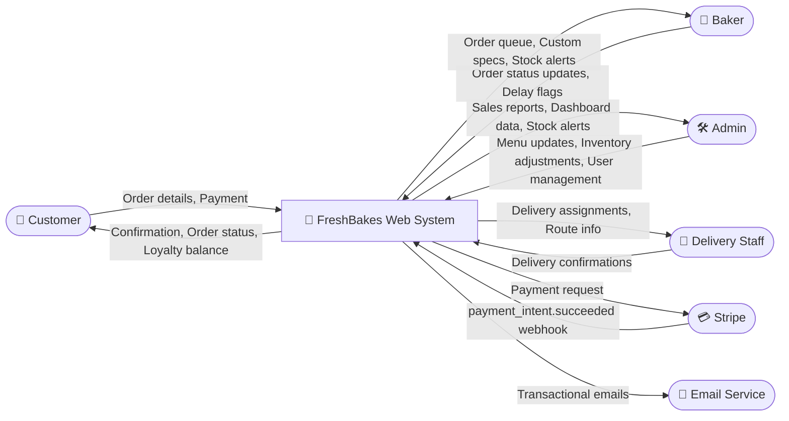
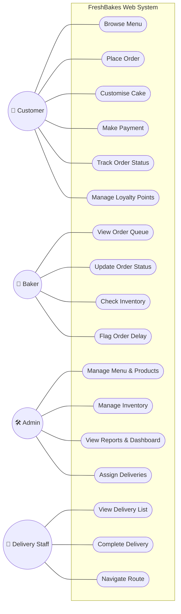
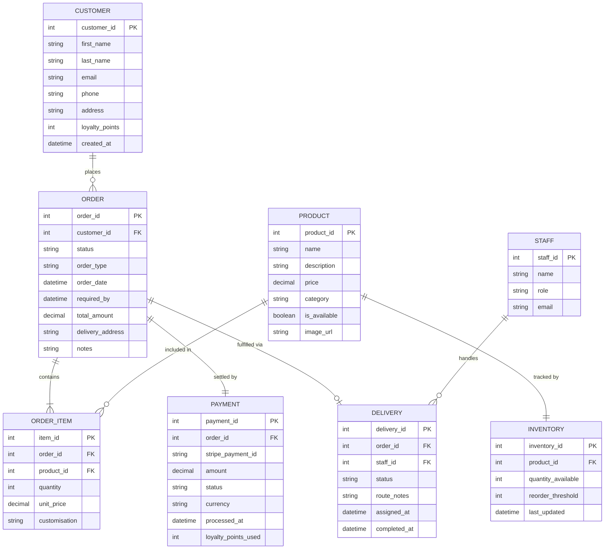

# FreshBakes Bakery — System Design Specification
### IS501 Project Report | Nicosia, Cyprus

---

> **Case Study:** FreshBakes Bakery is a family-owned shop in Nicosia, Cyprus, specialising in fresh pastries, cakes, and custom orders. The owner seeks a web-based system to manage customer orders, inventory, payments, and delivery scheduling in response to growing online demand and the post-2025 tourism boom.

---

## Table of Contents

1. [Phase 1 — Methodology Evaluation](#phase-1--methodology-evaluation)
2. [Phase 2 — Feasibility Study](#phase-2--feasibility-study)
3. [Phase 3 — Requirements Engineering](#phase-3--requirements-engineering)
4. [Phase 4 — System Design Specification](#phase-4--system-design-specification)

---

---

## Phase 1 — Methodology Evaluation

### 1.1 Overview

Two dominant systems analysis methodologies are considered for FreshBakes Bakery's web-based ordering platform: the **traditional Waterfall model** and the **Agile (Scrum) framework**. Each carries distinct strengths shaped by their core philosophy — Waterfall enforces sequential discipline; Agile embraces adaptive iteration.

---

### 1.2 Structured Comparison Table

| Criterion | Waterfall | Agile (Scrum) |
|---|---|---|
| **Philosophy** | Linear, sequential phases; each phase completed before the next begins | Iterative sprints (2–4 weeks); continuous delivery and feedback |
| **Requirements** | Fully defined upfront; changes are costly and discouraged | Requirements evolve across sprints; change is welcomed |
| **Change Management** | Formal change-control process; high cost of late changes | Lightweight; changes incorporated in next sprint backlog |
| **Customer Involvement** | Heavy at start (requirements) and end (acceptance); minimal during development | Continuous — Product Owner reviews every sprint demo |
| **Testing** | Deferred to a dedicated Testing phase near project end | Embedded in every sprint (Test-Driven Development encouraged) |
| **Documentation** | Comprehensive and mandatory at every phase gate | Lightweight — just enough to support the sprint |
| **Team Structure** | Role-siloed (Analysts → Designers → Developers → Testers) | Cross-functional squads; shared ownership |
| **Risk Profile** | High — failures discovered late; rework is expensive | Low — risks surfaced and addressed sprint-by-sprint |
| **Delivery** | Single release at project end | Incremental working software after each sprint |
| **Predictability** | High timeline/cost predictability if scope is stable | Variable scope; predictable velocity per sprint |
| **Best Suited For** | Regulatory systems, embedded systems, fixed-scope projects | Customer-facing apps, evolving UX, start-ups, R&D |

---

### 1.3 Specific Constraint Analysis

#### How Waterfall Handles "Inventory Rules"

FreshBakes' inventory logic is **rule-bound and deterministic**: a confirmed Stripe payment triggers an immediate stock deduction; reorder alerts fire at predefined thresholds; daily stock counts follow a fixed cycle. These are stable, well-understood business rules that can be fully specified upfront in a requirements document.

**Waterfall is appropriate here** because:
- The business logic does not evolve — "deduct 2 croissants per order" is not subject to customer feedback.
- A complete data model (SKU, quantity, threshold) can be designed once and built without iteration.
- Rigorous documentation of inventory rules supports future audits and staff training.
- Any deviation during development is caught in a formal testing phase against pre-written acceptance criteria.

*Weakness:* If a new inventory category (e.g., seasonal ingredient tracking) is introduced post-design, Waterfall forces a costly change-request cycle.

---

#### How Agile Handles "Custom Cake Design Iterations"

Custom cake orders are the **antithesis of fixed requirements** — a customer may not know they want a fondant tier until they see a mockup; the baker may suggest a flavour substitution mid-design; holiday themes change weekly. Requirements here are inherently emergent.

**Agile (Scrum) is superior here** because:
- Sprint 1 can deliver a basic order form (flavour, size, message); customer feedback refines Sprint 2 into a visual design picker.
- The Product Owner (bakery owner) demos each sprint and redirects based on real customer reactions.
- A/B testing of UI layouts for the cake configurator is natural within a sprint.
- Features like 3D cake previews or decorator collaboration can be added to a future sprint backlog without disrupting current work.

*Weakness:* Without discipline, scope creep risks delaying the core ordering system. A well-maintained backlog and sprint velocity tracking mitigate this.

---

### 1.4 Comparative Illustration (FreshBakes-Specific)

```
WATERFALL (Inventory Module)         AGILE (Custom Cake Module)
─────────────────────────────        ──────────────────────────────
 Requirements locked in Week 1        Sprint 1: Basic order form
         ↓                                    ↓ [Demo → Feedback]
 System Design (ERD, DFDs)            Sprint 2: Flavour/size picker
         ↓                                    ↓ [Demo → Feedback]
 Build inventory deduction logic      Sprint 3: Image upload + preview
         ↓                                    ↓ [Demo → Feedback]
 Integration test (Stripe hook)       Sprint 4: Baker approval workflow
         ↓                                    ↓
 Deploy — no mid-build surprises     Release — shaped by real users
```

---

### 1.5 Justified Recommendation: Hybrid Agile-First Approach

> **Recommended Methodology: Agile (Scrum) with Waterfall-style governance for the Inventory & Payment modules.**

**Rationale:**

FreshBakes is a **small business undergoing digital transformation** in a dynamic market (post-2025 tourism surge, evolving customer expectations). The majority of the system — ordering UX, custom cake configurator, delivery scheduling, loyalty tracking — benefits enormously from iterative refinement with real user input.

However, the **inventory and payment subsystems** have fixed, auditable rules (legal and financial compliance) that justify upfront specification. These can be treated as a Waterfall "mini-project" within Sprint 0, delivered as a stable backend API that the rest of the Agile sprints consume.

| Module | Recommended Approach | Justification |
|---|---|---|
| Inventory management | Waterfall (within Sprint 0) | Fixed rules, auditable, no UX iteration needed |
| Stripe payment integration | Waterfall (within Sprint 0) | Regulatory, deterministic, tested against spec |
| Online ordering / UX | Agile Scrum | Customer-driven, evolving, needs real feedback |
| Custom cake configurator | Agile Scrum | Inherently iterative, high UX complexity |
| Delivery route scheduling | Agile Scrum | Optimisation logic improves with usage data |
| Loyalty programme | Agile Scrum | Business rules will evolve with promotion cycles |
| Admin dashboard | Agile Scrum | Baker/admin needs discovered through use |

This **hybrid model** is well-supported in the literature (e.g., Boehm & Turner, 2003) and is pragmatic for a small team operating under budget and timeline constraints.

---

## Phase 2 — Feasibility Study (TELOS)

### 2.1 Technical Feasibility

FreshBakes requires a standard web stack — no exotic infrastructure. Cloud providers (AWS, GCP, or DigitalOcean) offer Cypriot-region hosting with ~99.9% SLA uptime, capable of handling 100+ daily orders without strain. Stripe's payment API is mature, well-documented, and already widely used in Cyprus e-commerce. A React/Next.js frontend + Node.js backend is a proven combination for SME food-ordering platforms. The delivery mobile interface can be delivered as a Progressive Web App (PWA) — eliminating app store overhead. No specialised hardware is needed; bakers and delivery staff require only a smartphone or tablet.

**Verdict: Technically feasible with low complexity.**

---

### 2.2 Economic Feasibility

> **Assumption note:** The following figures are planning estimates prepared for feasibility evaluation. They are intended to test economic viability for FreshBakes, not to represent vendor quotations or guaranteed revenue.

**Setup Cost Breakdown:**

| Item | Cost |
|---|---|
| Development (web + mobile PWA) | €3,500 |
| Cloud hosting setup + domain | €300 |
| Stripe integration & testing | €200 |
| Staff training & documentation | €600 |
| Contingency (10%) | €400 |
| **Total Setup Cost** | **€5,000** |

**Projected Annual Savings:**

| Savings Source | Estimated Annual Value |
|---|---|
| Eliminated order mix-ups & reprints | €3,000 |
| Reduced stockouts (better inventory) | €4,500 |
| Online orders from tourism traffic | €7,000 |
| Staff time savings (manual records) | €3,500 |
| Loyalty programme repeat business | €2,000 |
| **Total Projected Annual Savings** | **€20,000** |

**Cost-Benefit Analysis (3-Year Projection):**

| Year | Revenue/Savings | Operating Costs (hosting + maintenance ~€1,200/yr) | Net Benefit | Cumulative |
|---|---|---|---|---|
| Year 0 | — | €5,000 setup | -€5,000 | -€5,000 |
| Year 1 | €20,000 | €1,200 | €18,800 | **+€13,800** |
| Year 2 | €20,000 | €1,200 | €18,800 | +€32,600 |
| Year 3 | €20,000 | €1,200 | €18,800 | +€51,400 |

> **Projected Payback Period: ~3 months. Estimated ROI over 3 years: +928%**

**Verdict: Economically feasible, based on the stated planning assumptions and projected operating benefits.**

---

### 2.3 Legal Feasibility

Operating in Cyprus (EU member state), FreshBakes must comply with:

- **GDPR (Regulation 2016/679):** Customer data (names, emails, addresses, order history) must be collected with consent, stored securely, and deletable on request. The system must include a cookie consent banner and a privacy policy.
- **PCI DSS:** By delegating card handling entirely to Stripe (no card data stored server-side), FreshBakes remains out of PCI DSS scope — a significant legal and operational simplification.
- **Cyprus Consumer Protection Law (L.81(I)/2013):** Order confirmation emails, return/refund policies, and transparent pricing are required for online sales.
- **eIDAS & Electronic Signatures:** Order confirmations via email constitute valid electronic records under EU law.
- **Food Business Registration:** Already assumed compliant (existing bakery); the digital system introduces no new regulatory category.

**Verdict: Legally feasible, with standard compliance measures required for EU digital commerce.**

---

### 2.4 Operational Feasibility (Low Risk)

The primary operational risk is **staff adoption**. FreshBakes currently operates on notebooks and spreadsheets — a significant cultural shift to a digital dashboard is expected.

| Stakeholder | Challenge | Mitigation |
|---|---|---|
| Owner/Admin | Learning admin dashboard | Dedicated onboarding session; simple UI design |
| Bakers | Viewing order queue digitally | Large-font Baker Dashboard (tablet-optimised); training in Sprint 4 |
| Delivery Staff | Using mobile delivery app | PWA on personal phones; GPS turn-by-turn familiar from Google Maps |
| Customers | Online ordering adoption | Intuitive UX; tourism visitors already expect online ordering |

The 2025 Cyprus tourism boom is a *positive* operational factor — tourist customers actively prefer digital ordering over phone calls and have higher average order values. The system directly addresses FreshBakes' three stated pain points: stockouts, order mix-ups, and missing loyalty tracking.

**Verdict: Operationally feasible, with a structured change-management plan to support staff adoption.**

---

### 2.5 Schedule Feasibility

Using the recommended Agile (Scrum) approach with 2-week sprints:

| Phase | Duration | Key Deliverables |
|---|---|---|
| Sprint 0 (Foundation) | Weeks 1–2 | DB schema, Stripe integration, inventory API |
| Sprint 1–2 (MVP Ordering) | Weeks 3–6 | Online order form, baker dashboard, email confirmations |
| Sprint 3–4 (Payments & Inventory) | Weeks 7–10 | Stripe checkout, live stock deduction, admin dashboard |
| Sprint 5–6 (Delivery & Loyalty) | Weeks 11–14 | Delivery PWA, route assignments, loyalty points |
| UAT & Soft Launch | Weeks 15–16 | Real-order testing, bug fixes, staff training |
| **Full Go-Live** | **Week 16** | **~4 months total** |

A 4-month delivery timeline is realistic for a 2-person development team and aligns with completing the system before peak summer tourism season.

**Verdict: Schedule feasible, with go-live achievable within one business quarter under the proposed Agile plan.**

---

### 2.6 TELOS Summary

| Dimension | Status | Confidence |
|---|---|---|
| Technical | Feasible | High |
| Economic | Feasible | High — projected 3-month payback |
| Legal | Feasible | High — standard EU compliance |
| Operational | Feasible — low risk | Medium — staff training required |
| Schedule | Feasible | High — 16-week Agile delivery |

> **Overall Verdict: The FreshBakes web system is feasible across all five TELOS dimensions, based on the planning estimates and operational assumptions detailed above. The project is recommended for immediate initiation**, with operational risk managed through incremental Agile delivery and dedicated staff onboarding sessions.

---

## Phase 3 — Requirements Engineering

### 3.1 User Requirements

User requirements describe **what the system must allow each actor to do**, written in plain language from the stakeholder's perspective.

#### Customer

| ID | User Requirement |
|---|---|
| UR-C01 | The customer shall be able to browse the full product menu with photos and prices |
| UR-C02 | The customer shall be able to place an online order for collection or delivery |
| UR-C03 | The customer shall be able to customise cake orders (size, flavour, message, decoration) |
| UR-C04 | The customer shall be able to pay securely online via card (Stripe) |
| UR-C05 | The customer shall receive an order confirmation email immediately after payment |
| UR-C06 | The customer shall be able to track the real-time status of their order |
| UR-C07 | The customer shall be able to earn loyalty points per purchase and view their balance |
| UR-C08 | The customer shall be able to redeem loyalty points as a discount on future orders |
| UR-C09 | The customer shall be able to create and manage a personal account |
| UR-C10 | The customer shall be able to view their order history |

#### Baker

| ID | User Requirement |
|---|---|
| UR-B01 | The baker shall be able to view all incoming orders in a prioritised queue |
| UR-B02 | The baker shall be able to update the status of an order (e.g., Preparing → Ready) |
| UR-B03 | The baker shall be able to view the full specification of custom cake orders |
| UR-B04 | The baker shall be able to flag an order as delayed with a reason |
| UR-B05 | The baker shall be able to check current stock levels for any ingredient |

#### Admin (Owner)

| ID | User Requirement |
|---|---|
| UR-A01 | The admin shall be able to add, edit, and remove products from the menu |
| UR-A02 | The admin shall be able to manage inventory levels and set reorder thresholds |
| UR-A03 | The admin shall be able to view a dashboard of daily orders, revenue, and stock alerts |
| UR-A04 | The admin shall be able to manage customer accounts and loyalty point balances |
| UR-A05 | The admin shall be able to assign delivery orders to delivery staff |
| UR-A06 | The admin shall be able to generate sales and inventory reports |

#### Delivery Staff

| ID | User Requirement |
|---|---|
| UR-D01 | The delivery staff shall be able to view their assigned deliveries for the day |
| UR-D02 | The delivery staff shall be able to view customer address and contact details per delivery |
| UR-D03 | The delivery staff shall be able to mark a delivery as completed |
| UR-D04 | The delivery staff shall be able to access a suggested route via the mobile app |

---

### 3.2 Stakeholder Analysis

Identifying stakeholders and their concerns is a critical step in requirements engineering (Sommerville, 2016). A stakeholder is any individual, group, or system that has an interest in or influence over the system under development. The FreshBakes system involves both human actors and external technical services, each with distinct roles and expectations.

| Stakeholder | Role in the System | Key Needs / Concerns |
|---|---|---|
| Customer | Places online orders for collection or delivery | Fast ordering, secure payment, accurate order status, loyalty visibility |
| Baker | Prepares products and updates order progress | Clear queue visibility, custom order detail, low-stock awareness |
| Admin/Owner | Oversees products, stock, customers, reports, and delivery allocation | Operational oversight, reporting accuracy, easy product/inventory control |
| Delivery Staff | Completes assigned deliveries via mobile device | Clear route details, contact visibility, simple status updates |
| Stripe | External payment processor | Reliable payment confirmation and clear transaction handling |
| Email Service | Sends transactional notifications | Accurate trigger events and timely confirmation dispatch |

This stakeholder analysis follows the principle that stakeholders extend beyond direct users to include technical dependencies and process participants. Understanding each stakeholder's concerns early in the requirements process helps ensure that functional and non-functional requirements align with real operational needs rather than speculative assumptions.

---

### 3.3 Requirements Elicitation and Validation

The requirements for the FreshBakes system were derived through a combination of stakeholder interviews, observation of the bakery's current notebook-and-spreadsheet workflow, analysis of recurring operational problems, and review of low-fidelity interface prototypes.

#### Elicitation Approach

Requirements elicitation is the discovery phase in which the development team works directly with stakeholders to understand the application domain, existing services, and desired system capabilities. The following techniques were employed for FreshBakes:

- **Interviews with the owner/admin** clarified reporting, stock control, and delivery assignment needs for the bakery's daily operations. Closed interviews were used to validate specific feature expectations (e.g., "What data do you need in the daily dashboard?"), while open interviews explored broader pain points such as stockouts and order mix-ups.
- **Observation of the manual process** exposed implicit requirements around order handoff, stock visibility, and confirmation accuracy. Watching the baker work with the current notebook system revealed the need for a prioritised queue rather than a chronological list, and observing the owner manually assign deliveries highlighted the requirement for route support.
- **Baker and delivery workflows** informed queue management, delay handling, and route support requirements. Direct engagement with these actors helped ensure that technical requirements like SR-F04 (dashboard polling) and SR-NF10 (offline PWA cache) emerged from real operational constraints.
- **Prototype-oriented feedback** helped refine ordering, dashboard, and mobile delivery expectations. Low-fidelity wireframes allowed FreshBakes stakeholders to express tacit knowledge about their workflow needs.

#### Validation Approach

Requirements validation ensures that documented requirements actually define the system the customer wants. The FreshBakes requirements were validated against the following criteria:

- **Validity:** requirements address the bakery's stated problems of stockouts, order mix-ups, and missing loyalty tracking. Each user requirement traces directly to a documented operational pain point from the feasibility study.
- **Consistency:** user and system requirements avoid direct conflict and follow one shared order-status model (`Pending → Confirmed → Preparing → Ready → Out for Delivery → Delivered`). No requirement contradicts another.
- **Completeness:** customer, baker, admin, and delivery staff needs are all represented. The stakeholder table above confirms that every identified actor has associated user requirements.
- **Realism:** requirements remain achievable within the feasibility assumptions and SME-scale technology stack. Features like Stripe integration and PWA offline support are well-documented and proven in similar small business contexts.
- **Verifiability:** each major requirement can be checked through system behavior, response time, or process outcome. For example, SR-F02 specifies a measurable 30-second email delivery window, and SR-NF02 defines a testable 2-second page load threshold.

**Traceability:** User requirements (UR-\*) map to system requirements (SR-\*), which in turn inform the design artefacts presented in Phase 4 (UML diagrams, ERD, and wireframe designs). This explicit linkage ensures that every design decision can be justified by reference to a validated stakeholder need, maintaining consistency from elicitation through to implementation.

---

### 3.4 System Requirements

System requirements define **how the system must behave technically** to satisfy the user requirements above. These are measurable and testable.

#### Functional System Requirements

| ID | System Requirement | Linked UR |
|---|---|---|
| SR-F01 | The system shall deduct inventory quantities atomically upon Stripe `payment_intent.succeeded` webhook confirmation | UR-C04, UR-A02 |
| SR-F02 | The system shall send an order confirmation email within 30 seconds of successful payment | UR-C05 |
| SR-F03 | The system shall generate a unique order reference number for every confirmed order | UR-C05, UR-C10 |
| SR-F04 | The baker dashboard shall poll for new orders and refresh the queue every 30 seconds without a page reload | UR-B01 |
| SR-F05 | The system shall trigger a low-stock alert (email + dashboard notification) when any ingredient falls below its configured threshold | UR-A02, UR-B05 |
| SR-F06 | The system shall award loyalty points at a configurable rate (default: 1 point per €1 spent) upon order completion | UR-C07 |
| SR-F07 | The system shall validate that sufficient loyalty points exist before applying a redemption discount | UR-C08 |
| SR-F08 | The system shall prevent order submission if any required product is out of stock, displaying an informative message to the customer | UR-C02 |
| SR-F09 | The system shall support order status transitions: `Pending → Confirmed → Preparing → Ready → Out for Delivery → Delivered` | UR-C06, UR-B02, UR-D03 |
| SR-F10 | The system shall log all payment events (success, failure, refund) with timestamps in an audit trail | UR-A06 |

#### Non-Functional System Requirements

| ID | Category | Requirement |
|---|---|---|
| SR-NF01 | Performance | The system shall support a minimum of 100 concurrent active sessions without degradation |
| SR-NF02 | Performance | Page load time shall not exceed 2 seconds on a standard 4G connection |
| SR-NF03 | Availability | The system shall maintain ≥99.5% uptime, monitored via cloud provider SLA |
| SR-NF04 | Security | All customer data shall be encrypted in transit (TLS 1.3) and at rest (AES-256) |
| SR-NF05 | Security | No card data shall be stored server-side; all payment handling delegated to Stripe |
| SR-NF06 | Usability | The customer order form shall be completable in under 3 minutes by a first-time user |
| SR-NF07 | Usability | The baker dashboard shall be fully operable on a 10-inch tablet in portrait orientation |
| SR-NF08 | Compliance | The system shall comply with GDPR — providing data export and deletion on customer request |
| SR-NF09 | Scalability | The system architecture shall support horizontal scaling to handle seasonal demand spikes (e.g., Christmas, Easter) |
| SR-NF10 | Offline | The delivery mobile PWA shall cache the day's delivery list for offline access |

---

### 3.5 Why Agile is Superior for Delivery Route Optimisation

Delivery route optimisation is one of the most compelling examples of why a **pure Waterfall approach would fail** for this system.

**The problem with Waterfall here:**
A Waterfall project would require the team to fully specify the routing algorithm in Week 1 — before a single delivery has been made, before the team knows how many stops a typical day has, and before knowing whether drivers navigate by address, landmark, or GPS. Any upfront specification would be a guess, leading to a system built on incorrect assumptions that is expensive to change.

**How Agile solves this iteratively:**

```
Sprint 1  →  Manual assignment by admin (address list only)
               ↓ Real deliveries made. Insight: drivers prefer map view.

Sprint 2  →  Google Maps link embedded per delivery
               ↓ Insight: 3–5 deliveries per driver per day; clustering matters.

Sprint 3  →  Route suggestions based on postal district clustering
               ↓ Insight: drivers reorder stops themselves — need drag-to-reorder.

Sprint 4  →  Drag-and-drop route ordering + estimated time display
               ↓ Validated by actual driver usage data.
```

Each sprint produces **working, usable software** validated by the delivery staff who actually use it. The requirements for Sprint 4 could not have been written in Sprint 0 — they *emerged* from real operational experience.

This exemplifies Agile's core strength: **requirements are discovered through use, not imagined in advance.** For a feature as operationally nuanced as route optimisation, Agile is not just preferable — it is the only responsible approach.

---

## Phase 4 — System Design Specification

---

### 4.1 Context Diagram (DFD Level 0)

The context diagram presents the **FreshBakes Web System as a single process** surrounded by all external entities that interact with it. This establishes the system boundary.



---

### 4.2 DFD Level 1 — Order Flow

Level 1 decomposes the central system into its **six core processes**, showing how data flows between them, external entities, and data stores.


---

### 4.3 Use Case Diagram

Actors: **Customer, Baker, Admin, Delivery Staff**



---

### 4.4 Entity Relationship Diagram (ERD)

Entities: **Customer, Order, Product, Inventory, Payment** (plus supporting entities Order_Item, Delivery, Staff)



---

### 4.5 Order Fulfillment Flowchart

This flowchart traces the complete journey of an order, including the critical **stock availability check** and payment handling logic.


---

### 4.6 UI Wireframe Descriptions

> **Note:** These wireframes define layout, hierarchy, and component logic for implementation in Google Stitch or Figma. A separate prompt will generate the Stitch-ready prototype specifications.

---

#### (a) Customer Order Form

```
┌─────────────────────────────────────────────────┐
│  FreshBakes               [Login] [Cart (2)]    │
├─────────────────────────────────────────────────┤
│  [ Search menu... ]                             │
│  Categories: [All] [Cakes] [Pastries] [Custom]  │
├──────────────┬──────────────┬───────────────────┤
│ [img]        │ [img]        │ [img]             │
│ Croissant    │ Birthday Cake│ Sourdough Loaf    │
│ €2.50        │ From €35.00  │ €6.00             │
│ [Add to Cart]│ [Customise →]│ [Add to Cart]     │
├──────────────┴──────────────┴───────────────────┤
│  CUSTOM CAKE CONFIGURATOR (expands on click)    │
│  Size:    [6"] [8"] [10"] [12"]                 │
│  Sponge:  [Vanilla ▼]                           │
│  Filling: [Buttercream ▼]                       │
│  Message: [___________________________]         │
│  Upload reference image: [Attach file]          │
│  Special instructions: [___________________]    │
├─────────────────────────────────────────────────┤
│  ORDER TYPE:  ● Delivery   ○ Collection         │
│  Delivery address: [_______________________]    │
│  Required by: [Date picker]  [Time]             │
├─────────────────────────────────────────────────┤
│  Loyalty Points: 240 pts available              │
│  [ Apply 200 pts = -€2.00 discount ]            │
├─────────────────────────────────────────────────┤
│  Subtotal: €37.50    Discount: -€2.00           │
│  TOTAL: €35.50                                  │
│              [ Proceed to Payment → ]           │
└─────────────────────────────────────────────────┘
```

**Key UX Notes:**
- Product cards show real-time stock badges ("Only 3 left!")
- Custom cake configurator is a collapsible accordion
- Loyalty points section only shown to logged-in users
- "Proceed to Payment" disabled until all required fields are valid
- Mobile-responsive: single-column card layout on screens < 768px

---

#### (b) Baker Dashboard

```
┌─────────────────────────────────────────────────┐
│  Baker Dashboard — Good morning, Yianna!        │
│  Saturday 05 Apr  |  08:14                      │
├───────────────┬────────────────┬────────────────┤
│ QUEUE         │ STOCK ALERTS   │ COMPLETED      │
│ 14 orders     │ 3 items low    │ 7 today        │
├───────────────┴────────────────┴────────────────┤
│  ACTIVE ORDER QUEUE (auto-refreshes 30s)        │
│ ┌─────────────────────────────────────────────┐ │
│ │ #FB-2041  |  08:00  |  URGENT               │ │
│ │ 2x Croissant, 1x Custom Cake (Vanilla/8")  │ │
│ │ Note: "Happy Birthday Elena"               │ │
│ │ Collection: 10:30am                        │ │
│ │ [Start Preparing]  [Flag Delay]            │ │
│ └─────────────────────────────────────────────┘ │
│ ┌─────────────────────────────────────────────┐ │
│ │ #FB-2042  |  08:05  |  DELIVERY             │ │
│ │ 1x Sourdough, 3x Almond Croissant          │ │
│ │ Delivery by: 11:00am                       │ │
│ │ [Start Preparing]                          │ │
│ └─────────────────────────────────────────────┘ │
├─────────────────────────────────────────────────┤
│  LOW STOCK ALERTS                               │
│  • Almond Flour — 200g remaining  [Notify Admin]│
│  • Eggs — 6 remaining             [Notify Admin]│
└─────────────────────────────────────────────────┘
```

**Key UX Notes:**
- Optimised for 10-inch tablet; large tap targets (min 44px)
- Orders colour-coded: Red = urgent, Orange = delivery, Green = collection
- Status button advances order through workflow with single tap
- Low-stock alerts persist at bottom until admin acknowledges
- Sound alert option for new incoming orders

---

#### (c) Mobile Delivery App (PWA)

```
┌─────────────────────────┐
│ FreshBakes Delivery     │
│ Nikos — Sat 05 Apr      │
├─────────────────────────┤
│ TODAY'S ROUTE  (4 stops)│
│ ─────────────────────── │
│ [Done] 1. Makarios Ave 12│
│    FB-2038 — Delivered  │
│                         │
│ > 2. Ledra St 45 [NOW]  │
│    FB-2041              │
│    Maria Georgiou       │
│    Tel: 99-123456       │
│    Custom cake – FRAGILE│
│                         │
│    [Navigate]           │
│    [Mark Delivered]     │
│ ─────────────────────── │
│ 3. Athalassa Ave 8      │
│    FB-2043              │
│                         │
│ 4. Nicosia Mall Gate 2  │
│    FB-2045              │
├─────────────────────────┤
│ [All Orders] [Call HQ]  │
└─────────────────────────┘
```

**Key UX Notes:**
- PWA — works offline; delivery list cached at start of shift
- Active stop highlighted with arrow; completed stops greyed
- One-tap "Navigate" opens Google Maps with address pre-filled
- "Mark Delivered" requires confirmation tap to prevent accidents
- HQ call button visible on every screen for urgent contact

---

### 4.7 Release Plan

#### Phase 1 — MVP (Weeks 1–8)

*Goal: Replace notebooks and spreadsheets with a working digital ordering system.*

| Sprint | Weeks | Deliverables |
|---|---|---|
| Sprint 0 | 1–2 | DB schema, cloud environment, Stripe webhook integration, inventory API |
| Sprint 1 | 3–4 | Customer product browsing, order form, email confirmations |
| Sprint 2 | 5–6 | Baker order queue dashboard, order status workflow |
| Sprint 3 | 7–8 | Admin inventory management, low-stock alerts, basic admin dashboard |

**MVP Success Criteria:**
- Customer can place and pay for an order online ✓
- Baker receives and processes the order digitally ✓
- Inventory deducts automatically on payment ✓
- Admin can manage stock and view orders ✓

---

#### Phase 2 — Advanced Features (Weeks 9–16)

*Goal: Add loyalty, delivery optimisation, and reporting — differentiate from competitors.*

| Sprint | Weeks | Deliverables |
|---|---|---|
| Sprint 4 | 9–10 | Loyalty points system (earn + redeem), customer account history |
| Sprint 5 | 11–12 | Mobile Delivery PWA — assignment, status updates, map integration |
| Sprint 6 | 13–14 | Delivery route clustering, drag-to-reorder, estimated delivery times |
| Sprint 7 | 15–16 | Sales & inventory reports, UAT, staff training, go-live |

**Phase 2 Success Criteria:**
- Loyalty programme active with 50+ enrolled customers ✓
- Delivery staff operating exclusively via mobile app ✓
- Admin generating weekly sales reports ✓
- System live and handling real orders at full capacity ✓

---

### 4.8 Design Effectiveness Assessment

The system design addresses each of FreshBakes' original pain points directly:

| Pain Point | Design Solution | Requirement Satisfied |
|---|---|---|
| Stockouts during peaks | Real-time inventory deduction (SR-F01) + low-stock alerts (SR-F05) | UR-A02 |
| Order mix-ups | Unique order references (SR-F03) + digital baker queue (SR-F04) | UR-B01, UR-B03 |
| No loyalty tracking | Loyalty Engine process (SR-F06, SR-F07) | UR-C07, UR-C08 |
| Manual delivery scheduling | Delivery PWA with route optimisation (UR-D04) | UR-D01–D04 |
| No online presence | Full customer-facing web ordering system | UR-C01–C10 |

The **Agile-first hybrid methodology** proves its worth in Phase 4: the delivery route optimisation (4.2 DFD process 5.0) could not have been fully specified upfront, yet the ERD accommodates iterative enrichment of the `DELIVERY` entity's `route_notes` field without schema changes. The modular process design (6 discrete DFD processes) ensures each module can be tested independently per sprint — a direct architectural reflection of Agile's iterative delivery principle.
