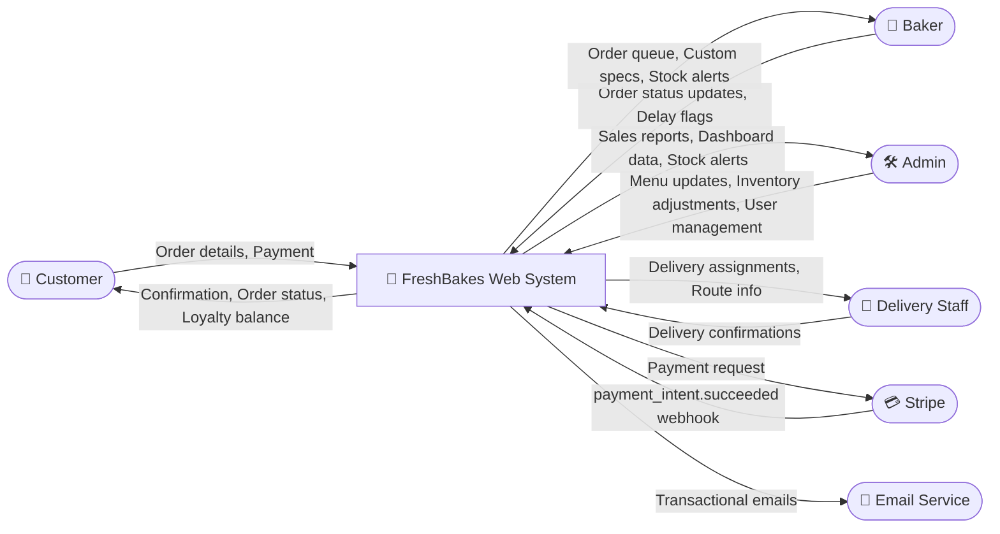

# Data Flow Diagram — Context Diagram (Level 0)

**FreshBakes Bakery | IS501 Project**

The context diagram presents the FreshBakes Web System as a **single process** surrounded by all external entities that interact with it. This establishes the system boundary and shows every external actor plus the direction and nature of each data flow.

**External Entities:** Customer, Baker, Admin/Owner, Delivery Staff, Stripe (Payment Gateway), Email Service

## Data Flow Summary

| From | To | Data |
|------|-----|------|
| Customer | System | Order details, payment authorisation |
| System | Customer | Order confirmation, real-time status, loyalty balance |
| Baker | System | Order status updates, delay flags, stock queries |
| System | Baker | Prioritised order queue, custom cake specs, stock alerts |
| Admin | System | Menu changes, inventory adjustments, user management |
| System | Admin | Sales reports, dashboard data, reorder alerts |
| Delivery Staff | System | Delivery completion confirmations |
| System | Delivery Staff | Delivery assignments, route information |
| System | Stripe | Payment requests |
| Stripe | System | `payment_intent.succeeded` webhook events |
| System | Email Service | Transactional notification triggers |
