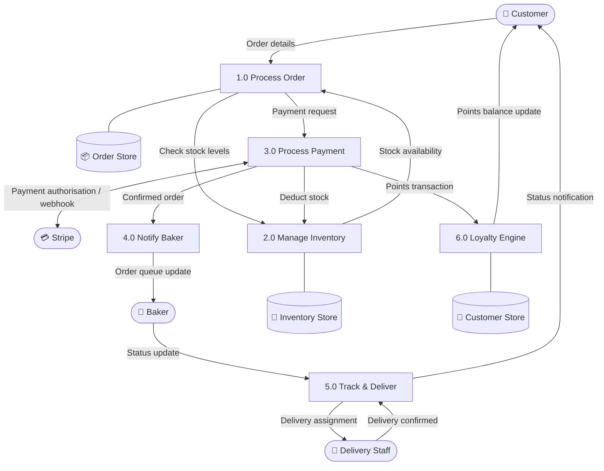

# Data Flow Diagram — Level 1 (Order Flow Decomposition)

**FreshBakes Bakery | IS501 Project**

Level 1 decomposes the central system into its **six core processes**, showing how data flows between them, external entities, and data stores. This diagram traces the complete path of an order from customer submission through to delivery.

**Processes:** 1.0 Process Order · 2.0 Manage Inventory · 3.0 Process Payment · 4.0 Notify Baker · 5.0 Track & Deliver · 6.0 Loyalty Engine

**Data Stores:** Order Store · Inventory Store · Customer Store

## Process Descriptions

| Process | Responsibility | Key Inputs | Key Outputs |
|---------|---------------|------------|-------------|
| 1.0 Process Order | Validates order details and checks stock before proceeding to payment | Order details from Customer | Payment request; stock check to Process 2.0 |
| 2.0 Manage Inventory | Tracks current stock; deducts on payment; raises low-stock alerts | Stock check requests; deduction triggers from Process 3.0 | Stock availability; updated Inventory Store |
| 3.0 Process Payment | Handles Stripe checkout flow and processes webhook confirmation | Payment request; `payment_intent.succeeded` from Stripe | Confirmed order to Baker; stock deduction trigger; loyalty transaction |
| 4.0 Notify Baker | Pushes confirmed orders to the baker queue | Confirmed order from Process 3.0 | Order queue update for Baker |
| 5.0 Track & Deliver | Manages order status transitions and delivery assignment | Status updates from Baker; delivery confirmations from Staff | Delivery assignment to Staff; status notification to Customer |
| 6.0 Loyalty Engine | Awards and redeems loyalty points per transaction | Points transaction from Process 3.0 | Updated loyalty balance to Customer Store and Customer |
