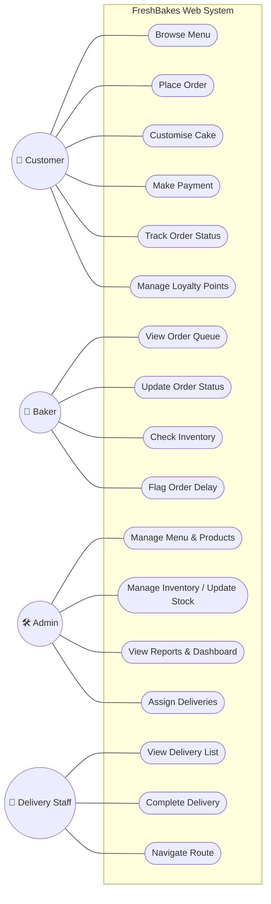

# Use Case Diagram

**FreshBakes Bakery | IS501 Project**

**Actors:** Customer · Baker · Admin/Owner · Delivery Staff

The diagram below shows all system use cases and their associations with the four primary actors. Detailed textual specifications for the key use cases are provided beneath the diagram.

## Key Use Case Specifications

### Use Case 1: Place Order
- **Primary Actor:** Customer
- **Preconditions:** Customer has selected one or more products and provided required order details.
- **Main Flow:** Customer reviews basket → selects delivery or collection → enters required details → proceeds to Stripe checkout → receives confirmation after successful payment.
- **Alternate Flow:** If stock is unavailable or payment fails, the system displays a clear message and prompts the customer to revise or retry.
- **Postcondition:** A confirmed order is recorded and routed for fulfilment.

### Use Case 2: Check Inventory / Update Stock
- **Primary Actor:** Admin/Owner (check + update); Baker (check only)
- **Preconditions:** Actor is authenticated; product inventory data exists.
- **Main Flow (Admin):** Admin reviews stock levels → updates quantities or reorder thresholds → saves changes.
- **Main Flow (Baker):** Baker views current ingredient levels from the dashboard stock panel.
- **Alternate Flow:** If invalid stock data is entered, the system rejects the update and prompts for correction.
- **Postcondition:** Current stock and threshold data is stored and available for ordering and alert processes.

### Use Case 3: Assign Deliveries
- **Primary Actor:** Admin/Owner
- **Preconditions:** Delivery-type orders exist in "Ready" status and delivery staff are available.
- **Main Flow:** Admin reviews ready deliveries → assigns an order to a delivery staff member → the staff member's mobile queue updates accordingly.
- **Alternate Flow:** If no driver is available, the order remains pending assignment and is flagged for follow-up.
- **Postcondition:** Delivery responsibility is recorded and visible to the assigned staff member.

### Use Case 4: Track Order Status
- **Primary Actor:** Customer
- **Preconditions:** A valid order has been created.
- **Main Flow:** Customer accesses the order reference or account view → sees the latest order status as it progresses through `Pending → Confirmed → Preparing → Ready → Out for Delivery → Delivered`.
- **Alternate Flow:** If the order reference is invalid, the system returns an error and requests a valid lookup.
- **Postcondition:** Customer receives an up-to-date status view without contacting the bakery manually.
