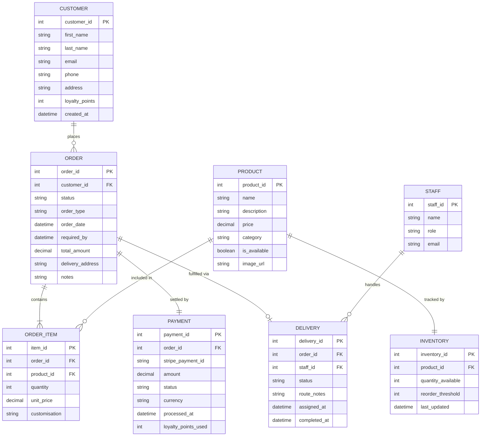

# Entity Relationship Diagram (ERD)

**FreshBakes Bakery | IS501 Project**

**Core Entities:** Customer · Order · Product · Inventory · Payment
**Supporting Entities:** Order\_Item · Delivery · Staff

## Entity Descriptions

| Entity | Description | Key Attributes |
|--------|-------------|----------------|
| **CUSTOMER** | Registered user who places orders and earns loyalty points | `customer_id`, `email`, `loyalty_points` |
| **ORDER** | A customer's placed order, tracking type and fulfilment status | `order_id`, `status` (`Pending→Delivered`), `order_type` (delivery/collection) |
| **ORDER_ITEM** | Line item linking an order to a specific product with quantity and any customisation notes | `item_id`, `quantity`, `customisation` |
| **PRODUCT** | A bakery item available for purchase, with availability flag | `product_id`, `price`, `is_available` |
| **INVENTORY** | Tracks current stock and reorder threshold for each product | `quantity_available`, `reorder_threshold` |
| **PAYMENT** | Records the Stripe transaction tied to an order, including loyalty points applied | `stripe_payment_id`, `amount`, `loyalty_points_used` |
| **DELIVERY** | Assignment of a delivery-type order to a staff member, with route notes and completion timestamp | `delivery_id`, `status`, `route_notes` |
| **STAFF** | Baker or delivery employee with an assigned role | `staff_id`, `role` |

## Relationships

| Relationship | Cardinality | Meaning |
|-------------|-------------|---------|
| CUSTOMER → ORDER | One-to-many | A customer may place many orders |
| ORDER → ORDER\_ITEM | One-to-many (mandatory) | Every order contains at least one line item |
| PRODUCT → ORDER\_ITEM | One-to-many | A product can appear in many order items |
| PRODUCT → INVENTORY | One-to-one | Each product has exactly one inventory record |
| ORDER → PAYMENT | One-to-one | Every confirmed order has exactly one payment record |
| ORDER → DELIVERY | One-to-zero-or-one | Only delivery-type orders have a delivery record |
| STAFF → DELIVERY | One-to-many | A staff member can handle many deliveries |
