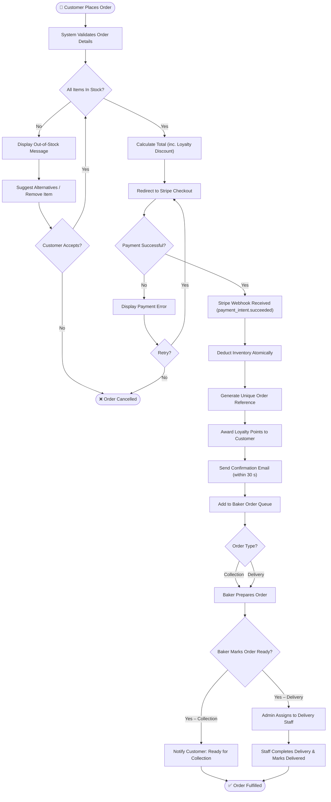

# Flowchart — Order Fulfillment Process

**FreshBakes Bakery | IS501 Project**

This flowchart traces the complete journey of a customer order from placement through to fulfillment. It includes the critical **stock availability check**, **Stripe payment handling**, **inventory deduction**, and the **collection vs. delivery** branch.

## Process Steps Summary

| Step | Decision / Action | System Requirement |
|------|------------------|--------------------|
| Stock check | Is every item in the basket available? | SR-F08 — blocks checkout when stock = 0 |
| Payment | Stripe checkout; retry on failure | SR-F10 — logs all payment outcomes |
| Webhook received | `payment_intent.succeeded` triggers backend | SR-F01 — atomic inventory deduction |
| Inventory deduction | Stock decremented immediately on payment | SR-F01 |
| Order reference | Unique reference generated per confirmed order | SR-F03 |
| Loyalty points | Points awarded at order completion rate | SR-F06 |
| Confirmation email | Dispatched within 30 seconds of payment | SR-F02 |
| Baker queue | Order appears in dashboard (auto-refresh every 30 s) | SR-F04 |
| Collection branch | Customer notified when order is ready | SR-F09 status: Ready |
| Delivery branch | Admin assigns to driver; staff marks delivered | SR-F09 status: Out for Delivery → Delivered |
